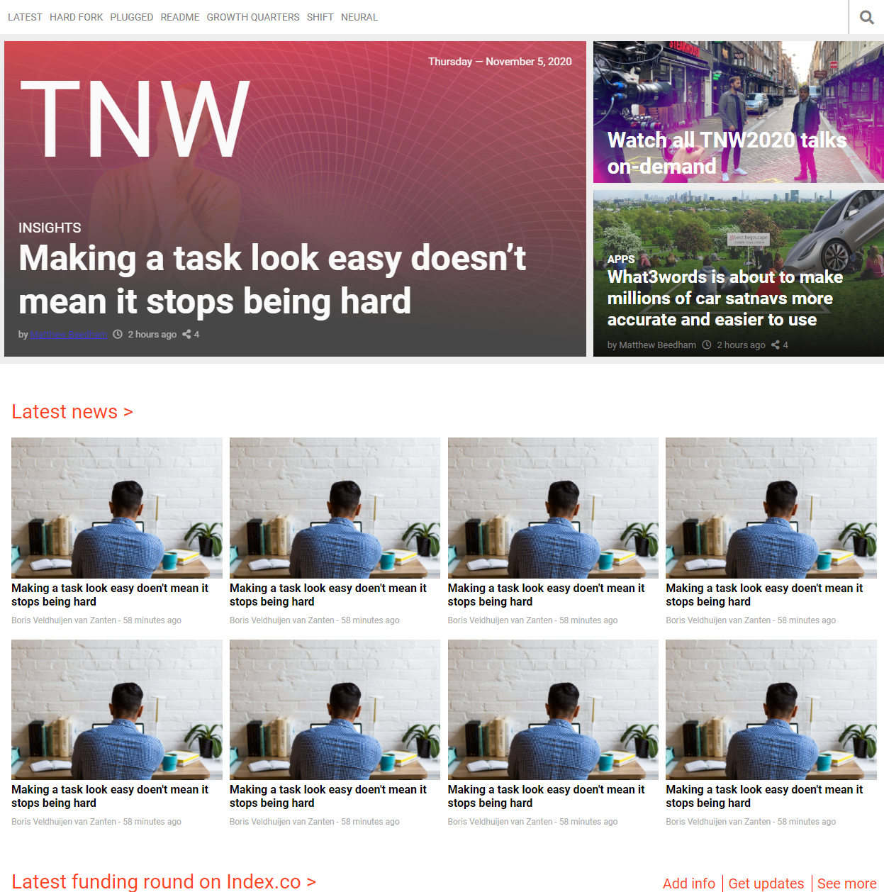

# TNW web clone

# Creating TNW web clone with responsive design.

This project consists of replicating the The Next Web website putting emphasis on how it behaves differently depending on the size of the screen where the website is rendered.

- HTML5
- HTML5 semantic
- CSS3
- flex box
- css grid
- styleling

In this project we made sure to consider to :

- Align elements with flex and grid.
- Use meadiqueries with 2 breakpoints.

## Built With

- HTML5 
- CSS
- VSC

## Live Demo

[Live Demo Link](https://wusinho.github.io/TNW-clone/)

😎 **Ahmed Amin**

- Twitter: [@Ahmed-Amin](https://twitter.com/AhmedAmin12383)
- LinkedIn: [LinkedIn](https://www.linkedin.com/in/ahmed-amin-quality/)

👤 **Heber Lazo**

- [@lazo_heber](https://www.linkedin.com/in/heber-lazo-benza-523266133/) [][linkedin]

- [@lazo_heber](https://twitter.com/lazo_heber) [][twitter]

## 🤝 Contributing

Contributions, issues, and feature requests are welcome!

Feel free to check the [issues page](https://github.com/Wusinho/NY-times/issues/).

## Show your support

Give a ⭐️ if you like this project!

## 📝 License

This project is [MIT](LICENSE) licensed.

[linkedin]: www.linkedin.com/in/heber-lazo
[twitter]: https://twitter.com/lazo_heber
